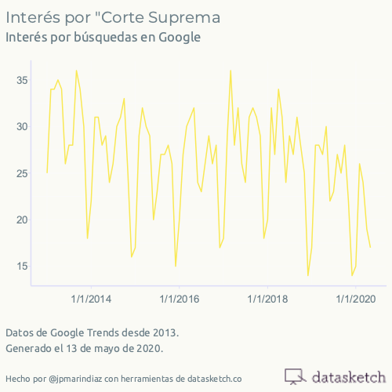
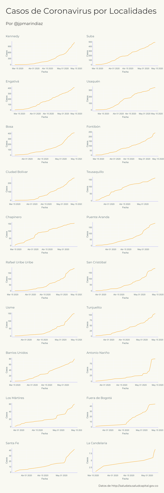

#30díasdegráficos con R

Gráficos por [jpmarindiaz](http://twitter.com/jpmarindiaz) para el [desafío](https://github.com/cienciadedatos/datos-de-miercoles/blob/master/30-dias-de-graficos-2020.md) de la comunidad hispanoblante de R. Cada día tiene su script asociado en la carpeta `scripts`.

## 2020-05-12 Atenidos

## 2020-05-13 Corte Suprema

## 2020-05-14 

## 2020-05-15

